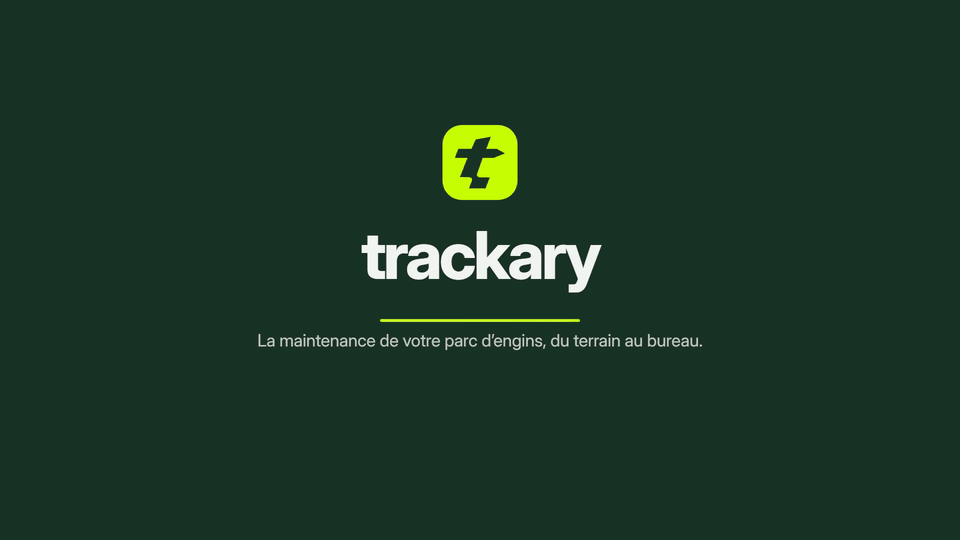

  <picture>
    <source media="(prefers-color-scheme: dark)" srcset="assets/logo-dark.svg">
    
  </picture>

  <strong>Romain Nivelle</strong> · THE LEVEL CODE 
  <a href="https://thelevelcode.com">thelevelcode.com</a> · <a href="mailto:contact@thelevelcode.com">contact@thelevelcode.com</a>

### Français

**Des logiciels qui tiennent sur le terrain.** Outils métier, applications mobiles hors ligne, SaaS B2B, assistants IA : je les conçois, je tranche l'architecture et je les fais tourner en production. Je relance aussi les projets à l'arrêt.

Mon produit : [Trackary](https://trackary.com), la GMAO des parcs d'engins, sur le web, le mobile et avec l'IA.

  

### English

**Software that holds up in the field.** Business tools, offline mobile apps, B2B SaaS, AI assistants: I design them, make the architecture calls and keep them running in production. I also restart stalled projects.

My product: [Trackary](https://trackary.com), maintenance management for equipment fleets, on web, mobile and AI.

TypeScript · React · React Native · Node.js · PostgreSQL · Python · Go · Docker · Cloudflare

