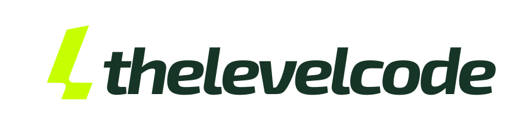
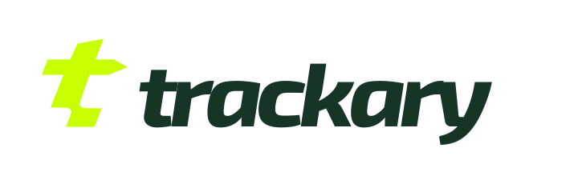

  <picture>
    <source media="(prefers-color-scheme: dark)" srcset="assets/logo-dark.svg">
    
  </picture>

  <strong>Studio de développement logiciel à Lille</strong> 
  Logiciel métier, application mobile et web, application terrain hors ligne, SaaS B2B, reprise de code.

  <a href="https://thelevelcode.com">thelevelcode.com</a> ·
  <a href="https://trackary.com">trackary.com</a> ·
  <a href="mailto:contact@thelevelcode.com">contact@thelevelcode.com</a>

<strong>Français</strong> · <a href="#what-we-do">English</a>

---

## Ce que nous faisons

Nous construisons l'outil qui colle au métier de nos clients, du cadrage à l'exploitation.

| | |
|---|---|
| **Logiciel métier sur mesure** | Un outil construit autour de vos règles, de vos rôles et de vos données. |
| **Application terrain** | Interventions, photos et comptes rendus des techniciens, même sans réseau. |
| **Application mobile et web** | iOS, Android ou web installable, selon l'usage réel. |
| **SaaS B2B** | Organisations, abonnements, administration et exploitation. |
| **Reprise de code** | Audit honnête, production sécurisée, puis évolutions par priorité. |

Le code est sur le dépôt du client dès le premier commit, les comptes des services tiers sont à son nom, sans licence ni frais de sortie.

## Notre produit : Trackary

**Trackary** est la GMAO des parcs d'engins : parc matériel, vérifications périodiques, entretien, anomalies et planning des techniciens, sur le web et sur mobile. L'application des techniciens fonctionne sans réseau et se synchronise au retour de la connexion. Un assistant IA propose les plannings et les actions ; c'est toujours l'humain qui valide.

Nous le concevons, le développons et l'exploitons nous-mêmes en production : hors ligne, synchronisation, sauvegardes et coûts d'exploitation sont des sujets que nous vivons au quotidien.

## Comment nous travaillons

1. **Cadrer** : une journée sur place avec les personnes qui utiliseront le logiciel. Pas de devis à l'aveugle.
2. **Construire** : une première version utilisable tôt, testée par vos équipes.
3. **Exploiter** : formation, documentation, supervision et sauvegardes testées.

## Stack

TypeScript · React · TanStack Start · React Native / Expo · Node.js (Hono) · PostgreSQL · Drizzle · Python · Go · Docker · Cloudflare

## Contact

THE LEVEL CODE — SASU · 266 rue Nationale, 59800 Lille
[contact@thelevelcode.com](mailto:contact@thelevelcode.com) · 06 73 80 64 34 · [thelevelcode.com](https://thelevelcode.com)

---

<a href="#ce-que-nous-faisons">Français</a> · <strong>English</strong>

## What we do

THE LEVEL CODE is a software studio based in Lille, France. We build the tool that fits our clients' work, from scoping to operations.

| | |
|---|---|
| **Custom business software** | Built around your rules, roles and data. |
| **Field service apps** | Technicians' jobs, photos and reports, even with no network. |
| **Mobile and web apps** | iOS, Android or installable web, depending on real use. |
| **B2B SaaS** | Organisations, subscriptions, administration and operations. |
| **Code takeover** | An honest audit, a secured production, then improvements by priority. |

The code lives in the client's repository from the first commit, third-party accounts are in their name, with no licence and no exit fees.

## Our product: Trackary

**Trackary** is a maintenance management system (CMMS) for equipment fleets: assets, periodic inspections, maintenance, defects and technician scheduling, on the web and on mobile. The technicians' app works offline and syncs when the connection is back. An AI assistant proposes schedules and actions; a person always approves them.

We design, build and run it ourselves in production, so offline mode, sync, backups and running costs are things we deal with every day.

## How we work

1. **Scope**: one day on site with the people who will use the software. No blind quotes.
2. **Build**: an early usable version, tested by your teams.
3. **Run**: training, documentation, monitoring and tested backups.

## Contact

THE LEVEL CODE — 266 rue Nationale, 59800 Lille, France
[contact@thelevelcode.com](mailto:contact@thelevelcode.com) · +33 6 73 80 64 34 · [thelevelcode.com](https://thelevelcode.com)
